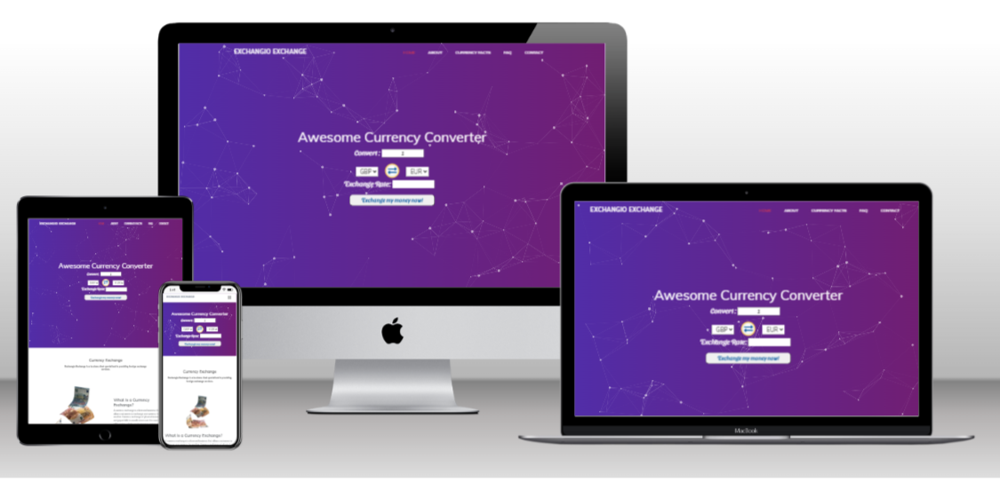

# Milestone Two

## Code Institute: Interactive Front-End Milestone Project


## Exchangio Exchange - [Live Site](https://vchopra86.github.io/ExchangioExchange-milestone-project-two/)

## Project Overview
Exchangio Exchange is a comprehensive web application designed to provide accurate and reliable foreign exchange rates. Users can convert currencies easily by inputting the amount in one currency and obtain the equivalent amount in another currency based on the current exchange rate., explore interesting currency facts, and find answers to frequently asked questions about currency exchange.

The project goal for the Exchangio Exchange website is to offer users a dependable and user-friendly platform for currency conversion while educating them on the historical and fascinating facts about different world currencies. This will involve fetching exchange rates from an API This project is tailored for travellers, business professionals, students, and anyone in need of quick and accurate foreign exchange rate information.

It will be constructed using HTML, CSS, JS & an API for the currency  conversions.

The website showcases a one page design consisting of sections. As for the currency facts sections these are inner page links.

The repository on Github that contains the website source code and assets is available at the following url: [Code Repository](https://github.com/VCHOPRA86/ExchangioExchange-milestone-project-two)

The website was built with a responsive look and feel for desktop, tablet and mobile devices

 - - - - 


# Table of Contents.

- [User Experience](#user-experience)
  * [User Stories](#user-stories)
    + [Travellers](#travellers)
    + [Students](#students)
    + [Customers](#customers)

   
- [Site Features](#site-features)
    + [Existing Features](#existing-features)
    + [Future Features](#future-features)
  

- [Wireframes](#wireframes)
 

- [Technologies Used](#technologies-used)
  + [Languages Used](#languages-used)
  + [Frameworks Libraries and Programs](#frameworks-libraries-and-programs)
  + [Application Programming Interface (API's)](#application-programming-interface-apis)
  
- [Testing](#testing "Goto Testing")


- [Deployment](#deployment)
 
- [Credits](#credits)
  + [Content](#content)
  + [Code](#code)
  + [Media](#media)
 
 - - - -

# User Experience

## User Stories

### Travellers


- As a traveller,
I want to quickly convert between different currencies,
so that I can easily understand the value of money in different countries.

- As a traveller, I want to access the platform on my mobile device so that I can use it on the go.


### Students

- As a student, I want a simple and intuitive interface for converting currencies so that I can manage my study budget effectively.

- As a student, I want to read interesting facts and historical information about different currencies to enrich my knowledge.

- As a student, I want to access the platform on my mobile device so that I can use it conveniently during my study breaks.

- As a student, I want to access exchange rates so that I can calculate expenses for my international studies.


### Customers

- As a customer, I want to browse the services offered by the currency exchange site so that I can decide whether to use the platform.

- As a customer, I want to view the current exchange rates without needing to create an account so that I can quickly get the information I need.

- As a customer, I want to exchange one currency for another so that I can use the foreign currency for my travels.

- As a customer, I want to see the current exchange rates for different currencies so that I can make informed decisions.


### Wireframes

Wireframes were created using [miro](https://miro.com/wireframe/) wireframe editor. Layouts were created for mobile and desktop to assist the design decisions before coding.

**Desktop**

* [One Page Design](https://github.com/VCHOPRA86/BurgerBoyz-milestone-project-one/blob/main/wireframes/desktop/Home-desktop.png)
* [Currency Fact inner pages](https://github.com/VCHOPRA86/BurgerBoyz-milestone-)

**Mobile**

* [One Page Design](https://github.com/VCHOPRA86/BurgerBoyz-milestone-project-one/blob/main/wireframes/desktop/Home-desktop.png)
* [Currency Fact inner pages](https://github.com/VCHOPRA86/BurgerBoyz-milestone-)


## Site Features

### Existing Features

1. Currency Conversion
Exchange Rates: Users can view exchange rates for a wide range of currencies.
Quick Conversion: Users can easily convert amounts between their chosen base and target currencies.
Rate Updates: The platform ensures that exchange rates are updated frequently to reflect current market conditions using the API from
https://www.exchangerate-api.com/


2. Educational Content
Currency Facts: A dedicated section with interesting and historical facts about various world currencies.

 User-Friendly Layout: Educational content is presented in an engaging and easy-to-read format.

3. Mobile/Tablet Accessibility: The website is fully optimized for mobile device & tablet devices, allowing users to access features on-the-go.

 Responsive Interface: The user interface adjusts seamlessly to different screen sizes and orientations.

4. Contact and FAQ Section: To help assist users with common questions.
Contact Form: Users can submit inquiries or feedback through an integrated contact form.

 - - - - 

# Technologies Used

## Languages Used

* [HTML5](https://en.wikipedia.org/wiki/HTML5)
  * For structuring the site pages.

* [CSS](https://en.wikipedia.org/wiki/Cascading_Style_Sheets)
  * For styling the content of each page.

* [JavaScript](https://en.wikipedia.org/wiki/JavaScript)
  * JavaScript for the API & contact form to function


## Frameworks Libraries and Programs


* [Bootstrap 4](https://getbootstrap.com/)
  * Framework used to form the layout of each page.

* [Font Awesome 5](https://fontawesome.com/)
  * Used for adding social media icons and location marker icons.

* [Miro](https://miro.com/)
  * Used for creating the wireframe mockups.

* [Pexels](https://www.pexels.com/)
  * Pexels was used to source imagery for the website.

* [CSS Gradient](https://cssgradient.io/)
  * For help with colour choses.
 
* [Favicon.io](https://favicon.io/)
  * Added a Favicon icon to the website.

* [Adobe Photoshop](https://www.adobe.com/ie/products/photoshop.html)
  * For image editing and resizing.

* [Techsini](https://techsini.com/multi-mockup/)
  * Techsini was used to help check responsiveness and take screenshots of the page at different screen sizes.

* [WebFormatter](https://webformatter.com/html)
  * WebFormatter was used to help beautify the code.

* [Google Chrome Dev Tools](https://developer.chrome.com/docs/devtools/)
    Google Chrome's Dev Tools were used while building the project to test responsiveness and for debugging.

 
* [Visual Studio Code](https://code.visualstudio.com/)
  * Integrated development environment (IDE) used for development.

* [GitHub](https://github.com/)
  * Used for managing and storing my code.

* [GitHub Pages](https://pages.github.com/)
  * Used to deploy the site.

## Application Programming Interface (API's)

* [Exchangerate-api.com](https://www.exchangerate-api.com/)
  *  Retrieve currency data from the exchangerate-api.com API using the free plan.
 - - - - 

## Testing

Please refer [here](TESTING.md) for more information on testing of the Exchangio Exchange website

 - - - - 

## Deployment
Visual Studio Code IDE was used to develop the website. The code was committed to git and pushed to GitHub within Visual Studio Code.

The site is hosted on Github Pages and was deployed using the following steps:

1. Log into GitHub
2. Select correct repository from the dashboard.
3. Select "settings" on the repository page.
4. Under "GitHub Pages" section, choose master branch as source.

Live site can be viewed here: [Exchangio Exchange](https://vchopra86.github.io/ExchangioExchange-milestone-project-two/)

### Local

1. Navigate to [https://github.com/VCHOPRA86/ExchangioExchange-milestone-project-two]
2. Click the green 'Clone or Download' button and copy the text url in the dropdown.
3. Open up a terminal window in your IDE of choice.
4. Navigate to your desired file location.
5. Paste the following code and input it into your terminal to clone.
```
git clone https://github.com/VCHOPRA86/ExchangioExchange-milestone-project-two.git
```

 - - - - 

## Credits

### Content
All content was written and developed by me.

### Code 
The following sites were used for inspiration and assistance:

* [CSS Tricks](https://css-tricks.com/)
* [Stack Overflow](https://stackoverflow.com/)

### Media
The images used on this site are royalty free and were obtained from [Pexels](https://www.pexels.com/)
