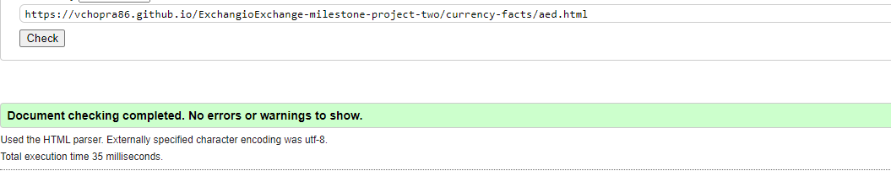
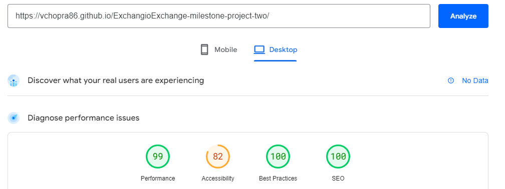
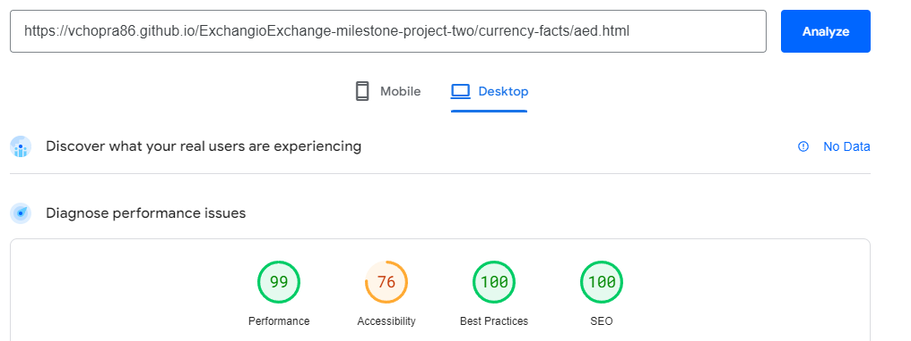

# Testing

The Exchange Exchange website has been tested using the following methods:
- [Code Validation](#code-validation)
    - [W3C HTML Validator](#w3c-html-validator) 
        - [One Page Site](#Main-Site)
        - [Inner Page Links - Currency Facts Section](#currency-facts)
      
    - [W3C CSS Validator](#w3c-css-validator)
- [PageSpeed Insights](#PageSpeed-Insights)
- [Responsiveness](#responsiveness)
- [Browser Compatibility](#browser-compatibility)
- [Project Feedback Review](#Project-Feedback-Review)
- [Bugs](#Resolved-Bugs)

# Code Validation

## W3C HTML Validator

Exchangio Exchange website has passed all tests using the W3C HTML Validator tool

### One Page Site
<h2 align="center"></h2>

### Inner Page Links - Currency Facts
<h2 align="center"></h2>

## W3C CSS Validator

Exchangio Exchange website has passed all tests using the W3C CSS Validator tool
<h2 align="center"></h2>

# PageSpeed Insights

### PageSpeed Insights Report for Main Site (Desktop)
<h2 align="center"></h2>

### PageSpeed Insights Report for Main site (Mobile)
<h2 align="center"></h2>

### PageSpeed Insights Report for Currency facts - Inner page (Desktop)
<h2 align="center"></h2>

### PageSpeed Insights Report for Currency facts - Inner page (Mobile)
<h2 align="center"></h2>

I used the pagespeed insights reports to examine the pages of the website for the following
- Performace
- Accessibility
- Best Practices 
- SEO

All Pages performed well (scored 76 and above overall) in:
- Performance, Accessibility, Best Practices and SEO.

# Browser Compatibility

The site was tested in Google Chrome, Microsoft Edge and Mozilla Firefox on desktop.

The site was tested in Google Chrome on mobile and tablet.

No issues detected during browser testing. CSS transitions worked on all browsers tested. 

Appearance, functionality and responsiveness were largely consistent across browsers and devices. Exceptions (see Resolved Bugs)

# Responsiveness

Responsivity tests were carried out using Google Chrome DevTools. Device screen sizes covered include:
- iPhone SE
- iPhone XR
- iPhone 12 Pro
- Pixel 5
- Samsung Galaxy S8+
- Samsung Galaxy S20 Ultra
- iPad Mini
- iPad Air
- Surface Pro 7
- Surface Duo
- Galaxy Fold
- Samsung Galaxy A51/71
- Nest Hub
- Nest Hub Max

I also personally tested the website on a Cubot kingkong Star, Dell laptop and a LG widescreen monitor.

# Project Feedback Review

In the final stages of the project, I received feedback from friends & family. 
The feedback on the website and documentation was positive overall.  Feedback included changing the color of the paragraphs from #999 to #2b2828 as some found it hard to read. Making the logo a clickable link back to the home page. Adding a'Back to Top' button visible on all screen sizes. All have been implemented

# Resolved Bugs

- Issues with the navbar icon not aligning correctly
   so added a header-flex class to fix the issue.

- There were issues with the mobile navbar when scrolling down the page. 
   I resolved this by adding the no-gutters class to the row element.

-  Referred to this link for help animate smooth scroll for nav anchor links

    https://stackoverflow.com/questions/7717527/smooth-scrolling-when-clicking-an-anchor-link

- Issues found on width size 280px with the logo being to large and the newsletter info button was overflowing outside of the max width. Both issues were fixed by reducing the font size of the logo and by changing the padding to 0. 

Back to [README.md](/README.md#testing)
